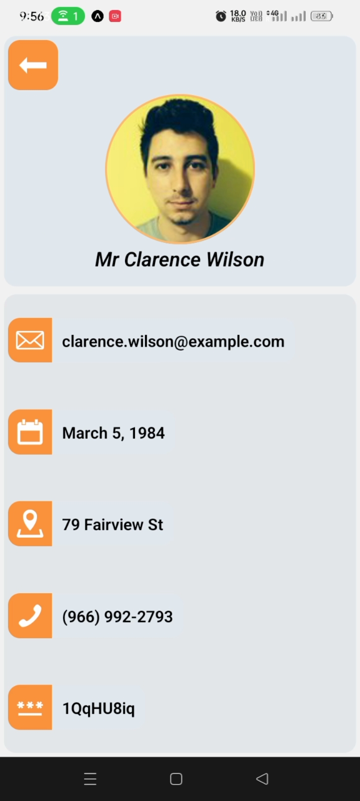

##  Components
* **Profile Cards:** Display user information such as name, email, date of birth, address, phone number, and other details.
* **Navigation:** Navigate between different user profiles.
* **Styling:** Utilizes `nativewind` and `tailwind CSS` for responsive and attractive UI.

