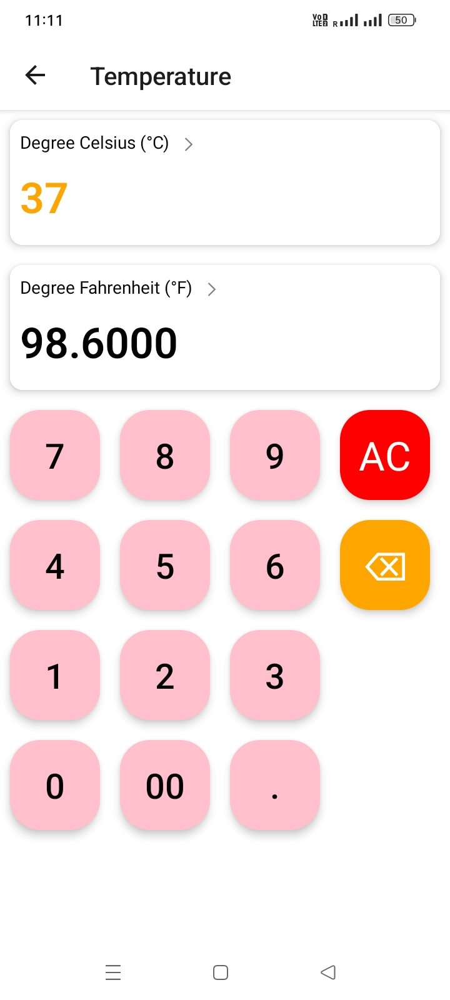

## ConvertXpert
ConvertXpert is a comprehensive and versatile React Native application designed to provide a wide range of unit conversions. 
It is a sophisticated and extensive project that includes multiple converters for various measurements, 
ensuring all your conversion needs are met in one place.

### _Download_ ⬇
[Download APK File](https://github.com/navedfakru/React-Native-Projects/blob/main/assets_file/ConvertXpert.apk)

