# React Native Projects

## 01 Components
* **Profile Cards:** Display user information such as name, email, date of birth, address, phone number, and other details.
* **Navigation:** Navigate between different user profiles.
* **Styling:** Utilizes `nativewind` and `tailwind CSS` for responsive and attractive UI.

## 02 SignUp-UI
### _Features_
- **SignUp Screen:** Allows users to enter their full name, email address, and password to create a new account.
- **Login Screen:** Provides an interface for users to enter their email address and password to log in.
- **Social Media Login:** Supports login with Google, Apple, and Facebook.
- **Styling:** Utilizes `nativewind` and `tailwind CSS` for responsive and attractive UI.

## 03 PasswordGenrator
### _Features_
* **Password Generation:** Generate random passwords with customizable length.
* **Copy to Clipboard:** Easily copy the generated password to the clipboard.
* **Options for Complexity:** Include numbers and special characters in the password.
* **React Concepts:** Utilizes `useState`, `useEffect`, `useCallback`, and `useRef` hooks from React.

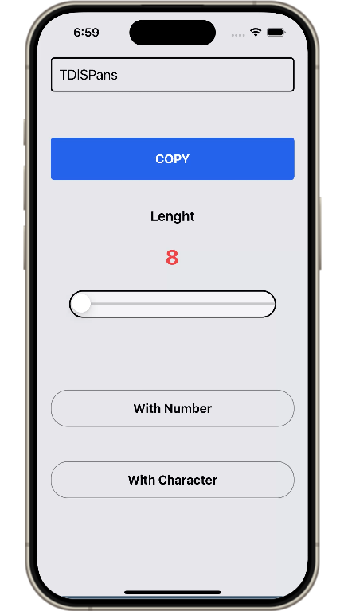
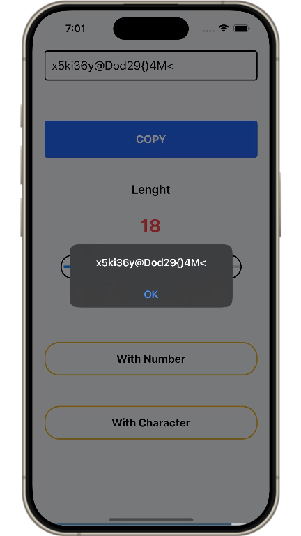
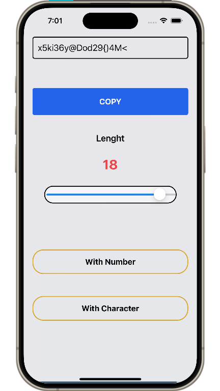

## 04 ConvertXpert
ConvertXpert is a comprehensive and versatile React Native application designed to provide a wide range of unit conversions. It is a sophisticated and extensive project that includes multiple converters for various measurements, ensuring all your conversion needs are met in one place.

### _Download_ ⬇
[Download APK File](https://github.com/navedfakru/React-Native-Projects/blob/main/assets_file/ConvertXpert.apk)

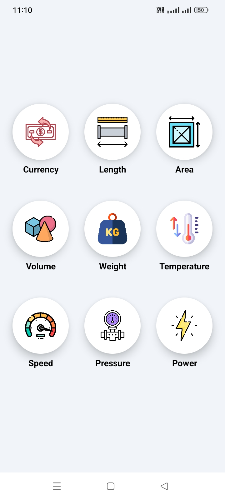
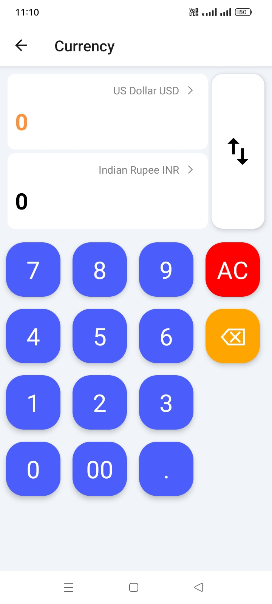

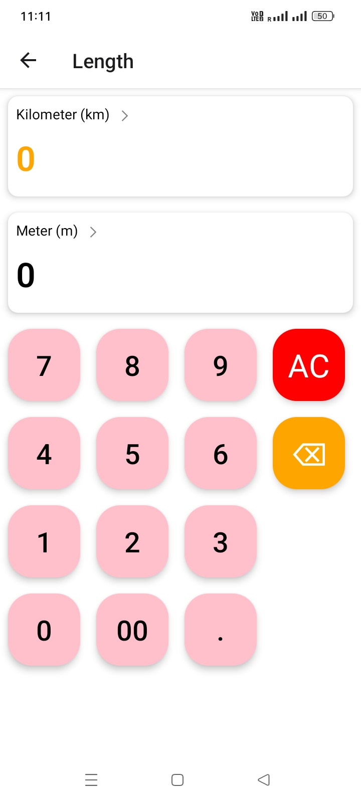
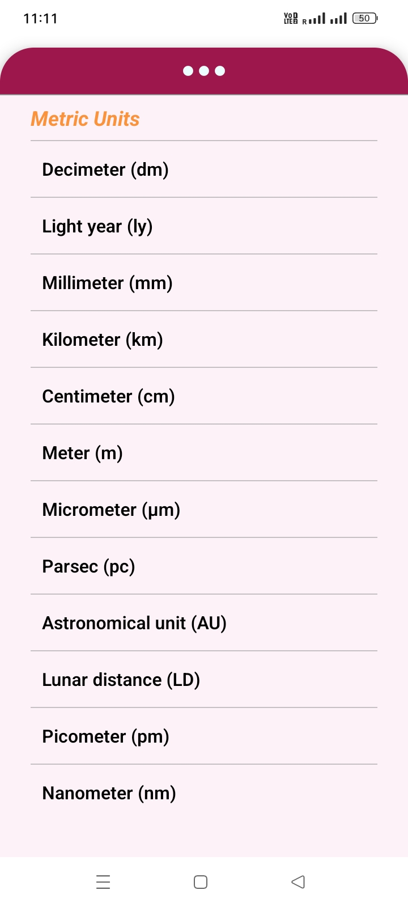
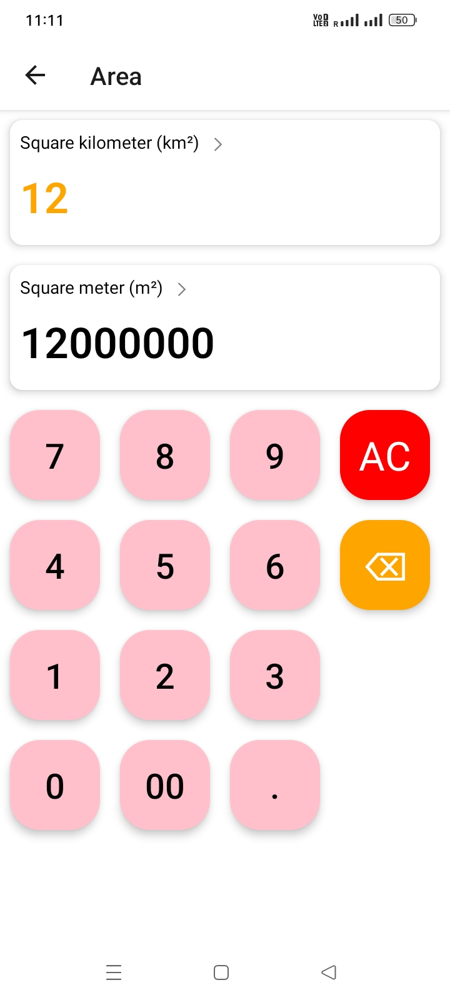
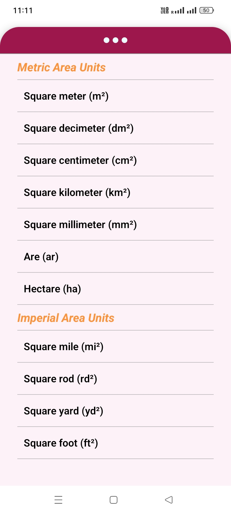
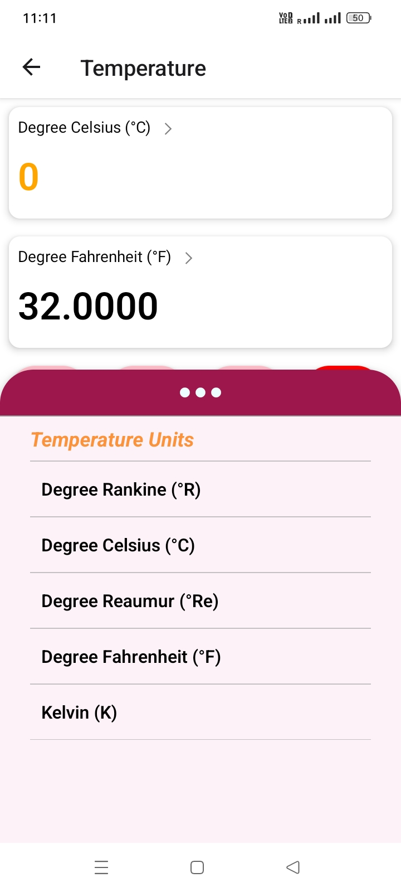
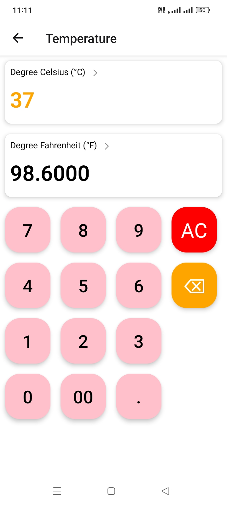

