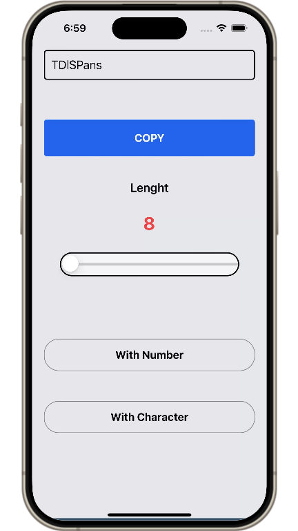
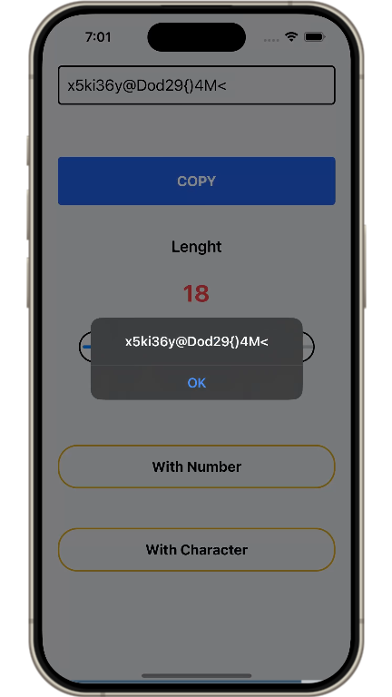
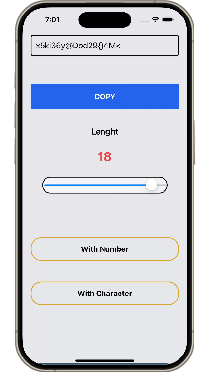

## PasswordGenrator
### _Features_
* **Password Generation:** Generate random passwords with customizable length.
* **Copy to Clipboard:** Easily copy the generated password to the clipboard.
* **Options for Complexity:** Include numbers and special characters in the password.
* **React Concepts:** Utilizes `useState`, `useEffect`, `useCallback`, and `useRef` hooks from React.

